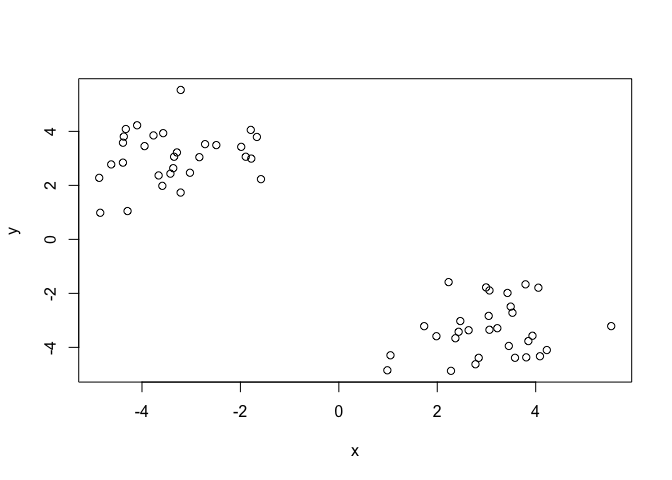
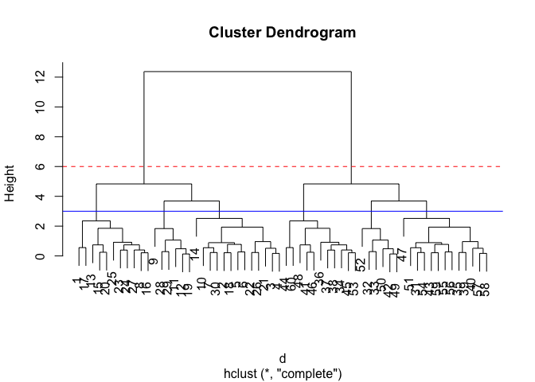
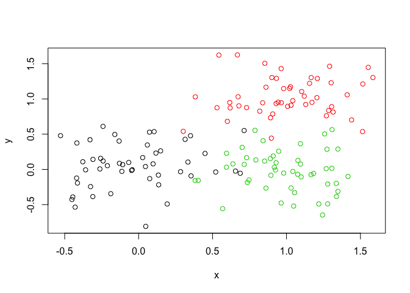
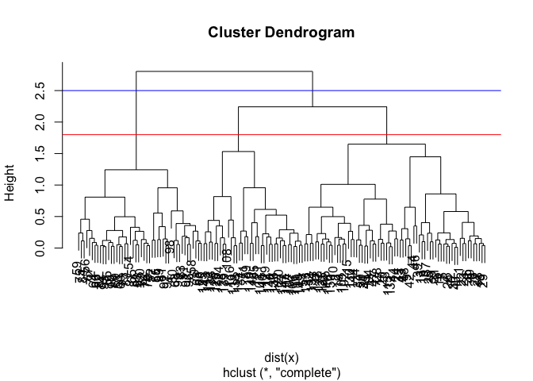
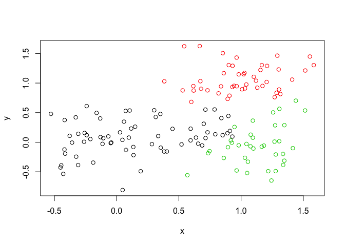
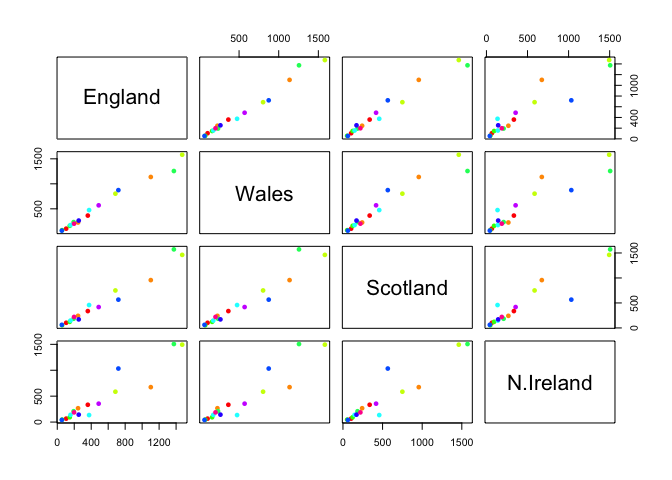

class09- machine learning pt1
================
Gayatri Mainkar
2/4/2020

The main K means function in R is called kmeans(). Let’s play with it
here.

``` r
#Generate some example data for clustering
tmp <- c(rnorm(30,-3), rnorm(30,3))
x <- cbind(x=tmp, y=rev(tmp))

plot(x)
```

<!-- -->

Use the kmeans() function setting k to 2 and nstart=20 Inspect/print the
results Q. How many points are in each cluster? Q. What ‘component’ of
your result object details - cluster size? - cluster
assignment/membership? - cluster center? Plot x colored by the kmeans
cluster assignment and add cluster centers as blue points

``` r
KM <- kmeans(x, centers = 2, nstart = 20)
KM$cluster
```

    ##  [1] 1 1 1 1 1 1 1 1 1 1 1 1 1 1 1 1 1 1 1 1 1 1 1 1 1 1 1 1 1 1 2 2 2 2 2 2 2 2
    ## [39] 2 2 2 2 2 2 2 2 2 2 2 2 2 2 2 2 2 2 2 2 2 2

``` r
KM$size
```

    ## [1] 30 30

``` r
KM$centers
```

    ##           x         y
    ## 1 -3.345044  3.064539
    ## 2  3.064539 -3.345044

``` r
plot(x)
points(KM$centers, col = "blue")
```

<!-- -->

## Hierarchial clustering in R

The main hierarchial clustering function in R is called ‘hclust()’ An
imortant point here is that you have to calculate the distance matrix
deom your input data before calling ‘hclust()’.

For this we will use the ‘dist()’ function first.

``` r
#We will use our x again from above...
d<- dist(x)
hc<- hclust(d)
plot(hc)
abline(h = 6, col = "red", lty = 2)
abline(h = 3, col = "blue")
```

<!-- -->

To get cluster membership vector I need to “cut” the tree at a certain
height to yield my separate cluster
    branches.

``` r
cutree(hc, h = 6)
```

    ##  [1] 1 1 1 1 1 1 1 1 1 1 1 1 1 1 1 1 1 1 1 1 1 1 1 1 1 1 1 1 1 1 2 2 2 2 2 2 2 2
    ## [39] 2 2 2 2 2 2 2 2 2 2 2 2 2 2 2 2 2 2 2 2 2 2

``` r
gp <- cutree(hc, k = 3)
table(gp)
```

    ## gp
    ##  1  2  3 
    ## 30 19 11

``` r
hc.complete <- hclust(d, method="complete")
hc.average  <- hclust(d, method="average")
hc.single   <- hclust(d, method="single")
```

``` r
x <- rbind(
  matrix(rnorm(100, mean=0, sd = 0.3), ncol = 2),   # c1
  matrix(rnorm(100, mean = 1, sd = 0.3), ncol = 2), # c2
  matrix(c(rnorm(50, mean = 1, sd = 0.3),           # c3
           rnorm(50, mean = 0, sd = 0.3)), ncol = 2))
colnames(x) <- c("x", "y")
# Step 2. Plot the data without clustering
plot(x)
```

<!-- -->

``` r
# Step 3. Generate colors for known clusters
#         (just so we can compare to hclust results)
col <- as.factor( rep(c("c1","c2","c3"), each=50) )
plot(x, col=col)
```

<!-- -->

Q. Use the dist(), hclust(), plot() and cutree() functions to return 2
and 3 clusters Q. How does this compare to your known ‘col’ groups?

``` r
hc2 <-hclust(dist(x))
plot(hc2)
cutree(hc2, k = 2)
```

    ##   [1] 1 1 1 1 1 1 1 1 1 1 1 1 1 1 1 1 1 1 1 1 1 1 1 1 1 1 1 1 1 1 1 1 1 1 1 1 1
    ##  [38] 1 1 1 1 1 1 1 1 1 1 1 1 1 2 2 2 2 2 2 1 2 2 2 2 2 2 2 2 2 2 2 2 2 1 2 2 2
    ##  [75] 2 2 2 2 2 2 2 2 2 2 2 2 2 2 1 2 2 2 2 1 2 2 2 2 2 2 1 1 1 1 1 1 1 1 1 1 1
    ## [112] 1 1 1 1 1 1 1 1 1 1 1 1 1 1 1 1 1 1 1 1 1 1 1 1 1 1 1 1 1 1 1 1 1 1 1 1 1
    ## [149] 1 1

``` r
grps <-  cutree(hc2, k = 3)
abline(h = 2.5, col = "blue")
abline(h = 1.8,col = "red") 
```

<!-- -->

``` r
plot(x, col = grps)
```

<!-- -->

Hands on Section

``` r
x <- read.csv("UK_foods.csv", row.names = 1)
barplot(as.matrix(x), beside=F, col=rainbow(nrow(x)))
```

<!-- -->

``` r
pairs(x, col=rainbow(10), pch=16)
```

<!-- -->

PCA with the ‘prcomp()’ function

``` r
pca <- prcomp(t(x))
summary(pca)
```

    ## Importance of components:
    ##                             PC1      PC2      PC3       PC4
    ## Standard deviation     324.1502 212.7478 73.87622 4.189e-14
    ## Proportion of Variance   0.6744   0.2905  0.03503 0.000e+00
    ## Cumulative Proportion    0.6744   0.9650  1.00000 1.000e+00

What is in my result object ‘pca’? I can check the attributes…

``` r
plot(pca$x[,1], pca$x[,2])
text(pca$x[,1], pca$x[,2], colnames(x), col = c("black", "red", "blue", "darkgreen"))
```

<!-- -->

``` r
## Lets focus on PC1 as it accounts for > 90% of variance 
par(mar=c(10, 3, 0.35, 0))
barplot( pca$rotation[,1], las=2 )
```

<!-- -->
